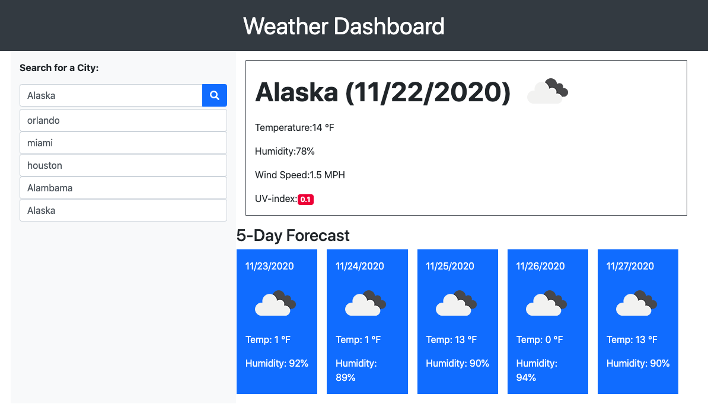

# weatherdashboard
Weather Dashboard

# Linked

[Github](https://github.com/wdavonta/weatherdashboard.git) "Weather DashBoard"

[Link] (https://wdavonta.github.io/weatherdashboard/)

# About the project
This project is about being able to see 5-Day forecast with current and future conditions for that city. You be able to see the city name, the date, an icon representation of weather conditions, the temperature, the humidity, the wind speed, and the UV index.

# Contact Info
Da'Vonta Williamson

E: <a href="mailto:wdavonta@gmail.com">wdavonta@gmail.com</a>
                </address>